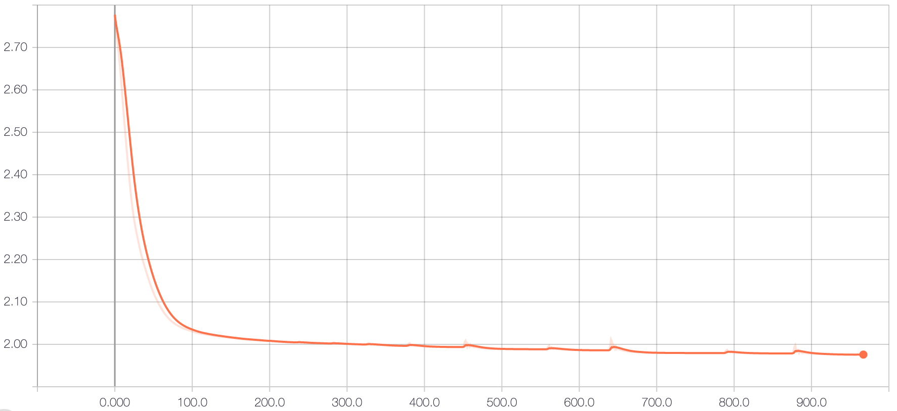

# Graph-based-Recommendation-System
## Structure of our repository
	.
	|-- README.md (here)
	|-- log (saved tensorboard log file)
	|-- ml-100k (dataset)
	|-- weights (saved model weights)
	|-- text (grid search text and ablation study results)
	|-- dataset.py 
	|-- train.py 
	|-- model.py
	|-- utils.py
	|-- loss.py

## Introduction of our project
In  this  project, we  use  the  link prediction based on the bipartite graph that represents therelationship  between  the  user  and  item.  The  message  passing by  graph  convolution  allows  us  to  describe  users  using  items’ information, and vice versa. The rating prediction is forced to fit  the  user  graph  and  item graph, such that the normalizedLaplacian is used to compute  the Dirichlet norms as the regularization term. The experiment has shown that our model can  reach  a  lowest  RMSE  around **0.938**.  Even  without  any  use  of side  features,  the  RMSE  can  still  stay  below **0.95**.


## Guideline to run our code:
### STEP 1: install required packages
```bash
pip: pip install -r requirements.txt   
conda: conda env create -f environment. yaml
```

### STEP 2: run code
```bash
python3 train.py --rate_num 5 \
                --lr 0.01 \
                --weight_decay 0.00001 \
                --num_epochs 1000 \
                --hidden_dim 5 \
                --side_hidden_dim 5 \
                --out_dim 5 \
                --drop_out 0.0 \
                --split_ratio 0.8 \
                --save_steps 100 \
                --log_dir './log' \
                --saved_model_folder './weights' \
                --dataset_path './ml-100k' \
                --save_processed_data_path './processed_dataset' \
                --use_side_feature 1 \
                --use_data_whitening 1 \
                --use_laplacian_loss 1 \
                --laplacian_loss_weight 0.05
```
You can observe the loss curve through the training by runing:
```bash
tensorboard --logdir=log/name_of_your_saved_file
```
<p align="center">
  
</p>
<p align="center">Figure 1: Loss curve.
</p>

## Gridsearch for best hyperparameters by running shell script:
The reult(RMSE) will be saved in a **gridsearch.txt** under the text folder.
```bash
sh run.sh -lr 0.01 0.02 -epochs 1000 2000 -hidden_dim 3 5 -side_hidden_dim 3 5 -dropout 0 0.1 0.2 -use_side_feature 0 1 -use_data_whitening 0 1 -use_laplacian_loss 0 1 -laplacian_loss_weight 0.05 0.1 | tee -a text/gridsearch.txt
```
